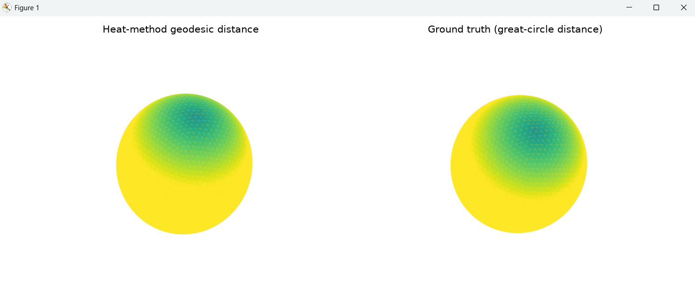

# SGI Prep: Geometry Processing Projects

A hands-on collection of discrete differential geometry and 3D geometry processing implementations built from first principles on triangle meshes and point clouds.

This repository tracks a 5-part project series designed for Summer Geometry Initiative (SGI) preparation, progressing from fundamental differential operators to geodesic distance fields, registration, and spectral analysis.

---

## 📌 Project Roadmap

- [x] **Project 1: Mesh Laplacian Smoothing & Curvature Estimation**
  - Constructing discrete cotangent Laplacian ($L$) and lumped mass ($M$) matrices.
  - Solving implicit (backward Euler) heat diffusion for unconditionally stable surface denoising.
  - Discrete mean curvature estimation ($H$) via the Laplace-Beltrami operator validated against analytical ground truth on a sphere.
- [x] **Project 2: Geodesic Distance via the Heat Method**
  - Short-time heat diffusion on surface meshes ($u_t = \Delta u$).
  - Vector field extraction and normalization ($X = -\nabla u / \Vert{}\nabla u\Vert{}$).
  - Solving the Poisson equation ($L\phi = \text{div}(X)$) to compute geodesic distances without path traversal.
- [ ] **Project 3: Rigid Point Cloud Registration (ICP)**
  - Point-to-point and point-to-plane Iterative Closest Point (ICP).
  - SVD-based optimal rotation and translation estimation.
- [ ] **Project 4: Parameterization & Harmonic Maps** *(Upcoming)*
- [ ] **Project 5: Spectral Shape Analysis & Geodesics** *(Upcoming)*

---

## 🛠️ Project 1 Details: Laplacian Smoothing & Curvature Estimation

### Key Principles
1. **Discrete Cotangent Laplacian ($L$):**
   Approximates the continuous Laplace-Beltrami operator $\Delta$ on triangle meshes:
   $$(Lf)_i = \sum_{j \in \mathcal{N}(i)} \frac{\cot\alpha_{ij} + \cot\beta_{ij}}{2} (f_j - f_i)$$
   Evaluated as positive semi-definite ($L = -\Delta$) to match `gpytoolbox` and sparse Cholesky/LU solvers.

2. **Implicit Smoothing:**
   Solves the unconditionally stable backward Euler system per coordinate axis $d \in \{x, y, z\}$:
   $$(M + tL) V_{\text{new}} = M V_{\text{old}}$$

3. **Mean Curvature Estimation:**
   Uses the identity $\Delta \mathbf{x} = 2H\mathbf{n}$ to compute mean curvature magnitude:
   $$H = \frac{1}{2} \Vert{}M^{-1} L V\Vert{}$$
   Benchmarked against a unit sphere ($H = 1.0$).

---

## 🌐 Project 2 Details: Geodesic Distance via the Heat Method

### Overview
Computes single-source geodesic distances across triangle meshes by solving two linear systems rather than performing combinatorial graph searches (e.g., Dijkstra) or non-linear PDE sweeps.

### Key Principles
1. **Heat Diffusion:**
   Diffuses an initial heat impulse $u_0$ from the source vertex for duration $t = c \cdot h^2$ (where $h$ is average edge length):
   $$(M + tL)u = M u_0$$

2. **Vector Field Normalization:**
   Evaluates the face-wise gradient $\nabla u = Gu$ and normalizes to obtain unit direction vectors pointing along geodesics:
   $$X = -\frac{\nabla u}{\Vert{}\nabla u\Vert{}}$$

3. **Poisson Reconstruction:**
   Recovers the distance field $\phi$ by integrating $X$ via a discrete divergence solve:
   $$L \phi = G^T A_3 X$$
   $L$ is regularized by fixing a reference vertex to $0$, followed by shifting $\phi \leftarrow \phi - \phi(\text{source})$.

### Results & Validation
Validated against the analytical great-circle distance $d(p, q) = \arccos(p \cdot q)$ on a unit sphere:



---

## 📦 Requirements & Environment Setup

### Prerequisites
- Python 3.10+
- A virtual environment (`venv` or `conda`)

### Installation
Clone the repository:
```bash
git clone [https://github.com/amanx98/sgi-prep-gp-projects.git](https://github.com/amanx98/sgi-prep-gp-projects.git)
cd sgi-prep-gp-projects